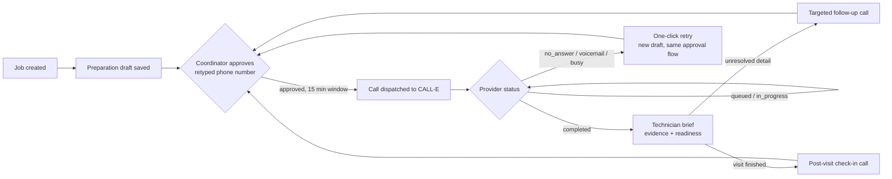

# RepairReady

A missed detail on an appliance-repair intake form — the wrong model number, an unmentioned
walk-up, an error code nobody wrote down — turns into a wasted truck roll: a technician drives
out, can't finish the job, and the visit has to be rescheduled. RepairReady is a private
pre-visit preparation desk that closes that gap with a real, automated [CALL-E](https://heycall-e.com)
phone call to the customer before a truck ever leaves, and turns the result into a technician
brief with a hard boundary between what a coordinator typed and what the call actually confirmed.

## At a glance

- **The call, not the form, is the source of truth.** Every fact on a brief is labeled by where
  it came from — coordinator entry (unverified) or call-confirmed — and a job is only marked
  ready for a technician when every required area is independently confirmed by the call itself.
- **A real phone number never gets dialed by accident.** Placing a call requires an explicit,
  re-typed, time-boxed approval, enforced at the database level — not just in application code.
  See [Trust & safety](#trust--safety) below and the deeper [design pattern write-up](docs/trust-and-safety-pattern.md).
- **The tool follows the job, not just the call.** Beyond the initial pre-visit call, it covers
  no-answer retries, targeted follow-up calls for what a prior call left unresolved, and a
  post-visit check-in call — plus reported safety hazards (gas smell, exposed wiring, etc.) are
  automatically flagged and pinned to the top of the queue.

## The job lifecycle



Status updates arrive two ways: the app polls every ~10s while a call is in flight (matching
CALL-E's own recommended pattern), and CALL-E also pushes a webhook the moment a call finishes, so
the readiness queue reflects reality even before a coordinator reopens the job. The webhook is
never trusted directly — see [Trust & safety](#trust--safety).

## Trust & safety

RepairReady never dials a number just because it's saved on a job.

1. **Prepared → approved → dispatched are three separate gates**, not one. Nothing before
   "approved" can reach the provider; nothing after dispatch can be re-approved.
2. **Approval requires re-typing the exact recipient phone number** — not a checkbox — plus a
   region and locale, and the approval expires after 15 minutes.
3. **The approval write is atomic and conditional**: it re-checks owner, lifecycle state, and
   prior approval state directly in the database write itself, so two concurrent approval
   attempts can't silently race each other.
4. **Server-reserved fields are never client-writable.** A call's provider ID, provider status,
   and timestamps can only be set by the server-side approve/dispatch/status logic.
5. **The CALL-E webhook is treated as an untrusted hint, never as data.** It carries no signature
   per CALL-E's own published spec, so the receiver ignores its body entirely and instead makes
   its own authenticated request back to CALL-E before writing anything. A forged webhook can at
   worst trigger one harmless extra status check — never fabricated call results.
6. **CORS is a hardcoded allowlist**, not a wildcard and not an echo of whatever origin a caller
   claims to be.

The full generalized version of the approval pattern — written to be usable outside this app
entirely — is in [`docs/trust-and-safety-pattern.md`](docs/trust-and-safety-pattern.md).

## How it decides a job is ready

Every piece of evidence on a brief carries two things: a **source** (entered by the coordinator,
or confirmed by the call) and a **status** (confirmed, missing, uncertain, unverified).
Coordinator entries are always labeled unverified until the call independently confirms them.
A job is only marked ready for technician review when every required evidence area — appliance
identity, symptoms, timing, error code, and access — is confirmed by the call itself, with no
unresolved follow-up detail and no explicit visit blocker. An explicitly reported safety hazard
(a gas smell, exposed wiring, a burning smell, etc.) always blocks readiness and is pinned above
every other job in the queue, regardless of how complete the rest of the preparation is.
Coordinator review of a brief is tracked separately and never changes the underlying evidence or
the readiness decision.

## Why CALL-E specifically

This isn't a thin wrapper around a single "make a call" endpoint. RepairReady uses:

- **`result_schema` / `recipient_result_schema`** to get back structured, typed evidence (brand,
  model, symptoms, error code, access constraints, visit blockers, consent, completion status)
  instead of parsing free-form transcript text.
- **`webhook_url`** on call creation, so the app is notified the moment a call finishes rather
  than relying on polling alone.
- **Idempotency keys** on every provider request, so a retried dispatch can never place a
  duplicate call.
- **Per-call region and locale**, auto-suggested from the recipient's own calling code rather
  than hardcoded, so the same tool works for a non-US customer without manual correction.

## Beyond call-confirmed facts: a diagnostic evidence engine

Once a call comes back, RepairReady doesn't just store the answers — it derives structure from
them, entirely from evidence already on the brief, with no separate call to an AI model:

- **Contradiction detection** flags when a call-confirmed answer conflicts with what the
  coordinator originally typed (e.g. a different model number), so a technician sees the
  disagreement instead of silently trusting whichever was saved last.
- **A diagnostic hypothesis with candidate parts to bring** — a likely subsystem and a
  confidence level, derived only from confirmed evidence, with every hypothesis traceable back to
  the specific answer(s) that support it. It is explicitly a hypothesis for the technician to
  verify on site, never a diagnosis or a repair promise — the underlying `PREPARATION_TASK`
  instructs the call agent never to diagnose, and this boundary is enforced in code: an
  explicitly reported safety hazard unconditionally suppresses hypothesis generation, checked as
  the very first step of the derivation.
- **A first-time-fix rate**, computed from technician-recorded visit outcomes, surfaced on the
  readiness queue. It reports "not enough data yet" rather than a misleading 0% until at least
  one outcome has been recorded.

## Quality

- 53 vitest tests covering the safety-critical logic specifically: phone validation, the
  readiness decision matrix, the safety-hazard detector, share-link gating, region/locale
  guessing, the follow-up/retry/post-visit question generators, adaptive question branching,
  contradiction/safety-flag/diagnosis derivation, and the first-time-fix metric. Run with
  `npm test`.
- 141 Deno tests covering the Edge Functions' pure logic directly (provider-ID/status validation,
  webhook payload sanitization, phone/region/locale normalization) — run with
  `deno test supabase/functions/*/logic.test.ts`.
- GitHub Actions CI runs lint, a full typecheck, both test suites, and a production build on
  every push (`.github/workflows/ci.yml`).
- Row-level security is enabled on all three tables (`repair_jobs`, `call_attempts`,
  `repair_briefs`), scoped to the authenticated owner.

## Known limitations / what's next

- No SMS/email auto-delivery of a technician's share link yet — a coordinator still copies and
  sends it manually. Deliberately not built without picking a real provider account first.
- No bulk approval/dispatch — bulk preparation exists, but each call is still approved and
  dispatched one at a time by design (see [Trust & safety](#trust--safety)).

## Stack

- **Frontend:** React, TypeScript, Vite, Tailwind, shadcn/ui
- **Backend:** Supabase (Postgres with row-level security, Auth, Edge Functions)
- **Voice:** [CALL-E](https://heycall-e.com)
- **Hosting:** Vercel

## Local development

```bash
npm install
cp .env.example .env.local   # fill in your own Supabase project's URL and publishable key
npm run dev
```

The Supabase project needs the functions in `supabase/functions/` deployed as Edge Functions, and
a `CALLE_API_KEY` secret configured on the Supabase project for the CALL-E integration to work.
`calle-webhook` must be deployed with JWT verification disabled, since CALL-E's webhook carries no
Supabase auth token — the other functions also run with verification disabled and do their own
JWT check internally instead.

## Project structure

```
src/
  entities/       Supabase-backed data access (repair jobs, call attempts, briefs)
  functions/      Typed client for the Supabase Edge Functions below
  lib/            Business logic: validation, readiness decisions, evidence merging
  components/     UI
  pages/          App shell and routing
supabase/
  functions/      Edge Functions: connection check, approve, dispatch, status-refresh, webhook,
                  and the public read-only shared-brief endpoint
docs/
  trust-and-safety-pattern.md   Reusable write-up of the approval pattern above
```
